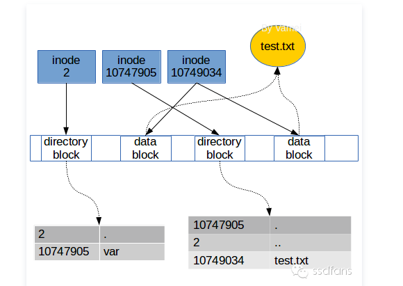

 ## linux系统打开的文件文件可以被另一个进程删除吗 
linux访问一个文件：  
从根目录/的inode不断做3个操作 ==》1、读取目录文件 2、找到对应的inode 3、从对应块读取内容   
如果3读取到的是一个目录文件，继续递归下去，知道读取到目标文件为止   

每个文件都会有2个link计数器-- i_count 和 i_nlink  
i_count的意义是当前使用者的数量，也就是打开文件进程的个数；i_nlink的意义是介质连接的数量  
可以理解为 i_count是内存引用计数器，i_nlink是硬盘引用计数器,当文件被某个进程引用时，i_count 就会增加；当创建文件的硬连接的时候，i_nlink  就会增加  
i_nlink 是文件删除的充分条件，而 i_count 才是文件删除的必要条件  

rm 操作只是将 i_nlink 置为 0 了  

<https://www.jianshu.com/p/dde6a01c4094>
<https://www.jianshu.com/p/fda6526aad1b>
<https://jaycechant.info/2020/correct-way-to-delete-an-opened-file/>

## 什么是僵尸进程
正常情况下，子进程是通过父进程创建的，子进程在创建新的进程。  
子进程的结束和父进程的运行是一个异步过程,即父进程永远无法预测子进程到底什么时候结束。 当一个 进程完成它的工作终止之后，它的父进程需要调用wait()或者waitpid()系统调用取得子进程的终止状态   

#### 孤儿进程
一个父进程退出，而它的一个或多个子进程还在运行，那么那些子进程将成为孤儿进程。孤儿进程将被init进程(进程号为1)所收养，并由init进程对它们完成状态收集工作

#### 僵尸进程
一个进程使用fork创建子进程，如果子进程退出，而父进程并没有调用wait或waitpid获取子进程的状态信息，那么子进程的进程描述符仍然保存在系统中

问题及危害
unix提供了一种机制可以保证只要父进程想知道子进程结束时的状态信息：  
在每个进程退出的时候,内核释放该进程所有的资源,包括打开的文件,占用的内存等。 但是仍然为其保留一定的信息(包括进程号the process ID,退出状态the termination status of the process,运行时间the amount of CPU time taken by the process等)。直到父进程通过wait / waitpid来取时才释放 

如果进程不调用wait / waitpid的话， 那么保留的那段信息就不会释放，其进程号就会一直被占用，但是系统所能使用的进程号是有限的，如果大量的产生僵死进程，将因为没有可用的进程号而导致系统不能产生新的进程. 此即为僵尸进程的危害，应当避免   

<https://www.cnblogs.com/anker/p/3271773.html>

## Ubuntu断电之后重启ext4变成ro
mount发现 "/dev/sda2 on / type ext4 (ro,relatime)"

执行 mount -o remount, rw / 后出现"mount: /: mount point not mounted or bad option."   
解决过程中发现 umount dev/sda2 可以执行成功但是不起作用mount发现还是挂载到ext4下面   
/etc/fstab 文件也改不了因为是只读的文件   

后面执行 fsck.ext4 -p /dev/sda2 （针对ext4型文件系统进行检测）   
 

然后执行 mount -o remount, rw / 成功

重启docker发现   

之前关闭ext4的日志系统时也遇到过docker重启失败的问题，后来 systemctl restart containerd解决了,这次尝试发现不行  
后面执行 rm /etc/docker/key.json 再 systemctl status docker.service 成功

<https://blog.csdn.net/lilywri823/article/details/86607247>
<https://blog.csdn.net/controllerha/article/details/78828584>

## linux常见命令
- 系统监控   
top：实时显示系统中各个进程的资源占用状况（系统当前时间，开机时间，在线用户，任务，cpu信息，内存交换空间，进程信息）  
iotop：和top差不多 ，-o参数会显示实际有io的进程   
free：查看系统可用内存 （total/used/free/shared/buffers/cached）   
iostat：来动态监视系统的磁盘操作活动（%iowait：CPU等待输入输出完成时间的百分比，%idle：CPU空闲时间百分比，%iowait的值过高，表示硬盘存在I/O瓶颈，%idle值高，表示CPU较空闲，如果%idle值高但系统响应慢时，有可能是CPU等待分配内存，此时应加大内存容量，%idle值如果持续低于10，那么系统的CPU处理能力相对较低，表明系统中最需要解决的资源是CPU）   
vmstat：虚拟内存状态，但是它可以报告关于进程、内存、I/O等系统整体运行状态   
ulimit ：限制系统用户对shell资源的访问   
df：查看文件系统的磁盘空间占用情况 （-h方便阅读）   
du：输出指定文件或目录使用的估计磁盘空间量（默认当前目录也可以指定目录）   
ps：列出系统中当前运行的进程（-A 显示所有进程,-f 显示程序间的关系:ps -ef）

-  文件操作   
tail：显示指定文件末尾内容 （-f：循环读取，-n显示行数）   
find：在指定目录下查找文件   
ll：列出当前文件或目录的详细信息，时间、读写权限、大小、时间（ls -l 别名）   
chmod：对文件的权限进行设置和更改   
grep：文本搜索工具搜索正则表达式   
sed：文本处理工具（-i:直接修改读取的文件内容  a:新增 c:取代 d:删除 i:插入 s:取代(正则) p ：列印）
awk：文本分析工具并生成报告

- 网络通信   
iftop: 查看每个连接的实时速率   
netstat：显示网络相关信息（网络连接，路由表，接口状态，masquerade等，-a所有选项）  

## Linux根据进程查看所占用的端口
eg: 查看nginx进程pid   
ps -ef | grep nginx （查看进程pid）   
netstat -nap | grep pid （查看占用端口）

## 处理端口占用
netstat -tln | grep 8088  （查看端口使用情况）   
lsof -i :8088  （查看端口属于哪个程序）   
kill -9 pid  （ 杀掉占用端口的进程）

## 统计nginx日志文件中的每个状态码出现的次数和对应的URL
awk '{print $9}' access_log |sort | uniq -c | sort -n -r (没有对应的url)

查看日志中访问次数最多的前10个IP：

    cat access_log |cut -d ' ' -f 1 | sort |uniq -c | sort -nr | awk '{print $0 }' | head -n 10 | less

 <https://blog.csdn.net/jirryzhang/article/details/82467554> 

## 删除大量文件（rsync）
mkdir /tmp/test  （建立一个空的文件夹）   
rsync --delete-before -a -H -v --progress --stats /tmp/test/ log/ （用rsync删除目标目录） 
    
    –delete-before 接收者在传输之前进行删除操作
    –progress 在传输时显示传输过程
    -a 归档模式，表示以递归方式传输文件，并保持所有文件属性
    -H 保持硬连接的文件
    -v 详细输出模式
    –stats 给出某些文件的传输状态
    
rm删除内容时，将目录的每一个条目逐个删除(unlink)，需要循环重复操作很多次, rsync删除内容时，建立好新的空目录，替换掉老目录，基本没开销

<http://www.361way.com/rsync-fast-del-file/4681.html>

## linux的fork了解吗？什么是写时复制机制？
fork()：创建子进程，父进程返回子进程的PID，子进程返回0
fork时子进程获得父进程数据空间、堆和栈的复制，变量的地址（虚拟地址）也是一样的，但没有复制物理页面

在页根本不会被写入的情况下---例如，fork()后立即执行exec()，地址空间就无需被复制了

COW(写时复制)：
fork()之后，kernel把父进程中所有的内存页的权限都设为read-only，然后子进程的地址空间指向父进程。当父子进程都只读内存时，相安无事。当其中某个进程写内存时，CPU硬件检测到内存页是read-only的，于是触发页异常中断（page-fault），陷入kernel的一个中断例程。中断例程中，kernel就会把触发的异常的页复制一份，于是父子进程各自持有独立的一份。

<https://juejin.im/post/5bd96bcaf265da396b72f855>
<https://www.cnblogs.com/wuchanming/p/4495479.html>
<http://xstarcd.github.io/wiki/shell/exec_redirect.html>

## 软连接和硬链接了解吗？它们有什么区别？底层如何实现的？
- 硬链接: 与普通文件没什么不同，inode 都指向同一个文件在硬盘中的区块   
删除源文件，硬链接的文件仍然在，文件系统会维护一个引用计数，只要有文件指向这个区块，它就不会从硬盘上消失   
- 软链接: 保存了源文件的绝对路径，inode 都指向不同的内存空间，在硬盘上有独立的区块，访问时替换自身路径   
删除源文件，软连接的文件也访问不了，因为软连接文件保存的是源文件的绝对路径，此时往软连接的文件中写东西，源文件也被创建

## linux EXT4
- 发展历史： 
1、MINIX : 微机的一个非常小的Unix操作系统，最多能处理14个字符的文件名，只能处理 64MB 的存储空间    
2、EXT1: 第一个利用虚拟文件系统, 2GB存储空间并处理255个字符的文件名    
3、EXT2: 商业级文件系统, GB级别的最大文件大小和TB级别的文件系统大小    
4、EXT3 : 增加日志功能    
5、EXT4: 提供更佳的性能和可靠性,更大的文件系统和更大的文件、无限数量的子目录、Extents、多块分配、延迟分配,快速 fsck、日志校验,"无日志"（No Journaling）模式    
<https://ccie.lol/knowledge-base/linux-file-system-ext4/>

- EXT4内部  
文件记录最小单位：Block（4K）  --> 8个sector（512B）   
Superblock: 相当于概览，记录inodes_count、blocks_count、block_per_group、free_inodes_count、first_data_block等总的信息   

    ext4系统把文件分成一个个的group，每个group都会有一个Super block的副本   
    

    Block Group Descriptor: 分组之后每个group的信息，记录inode bitmap、block bitmap、inode table、free block count等等 

    inode bitmap: 标签分布表，表示inode table哪些条目是占用的  
    block bitmap: block分布表，表示哪些block里面有数据   
    inode table: 标签表, group文件的标签，一个文件对应一个标签，记录文件的权限、大小、查看时间、修改时间等信息   

    inode标签除了上面的内容，还记录了文件所在的位置，放在哪些block里面   
    但是一个文件可能对应成前上万个block，block只留了60字节保存查找信息，放不下所有的信息  
    于是设计查找算法:   
    ext3用的是三级映射（类似B树）    
    ext4用的是扩展树（类似B+树）    
    <https://cloud.tencent.com/developer/article/1551286>
    
- 查找过程（每个目录有一个inode还有一个dentry）  
eg：要找一个文件/var/test.txt   
1、通过根目录/的dentry得到inode2，到目录盒子和每个dentry比较(Hash算法，不是一个个比较)，发现var的dentry； 
2、找到var的inode 10747905，到目录盒子和每个dentry比较，发现test.txt的dentry；  
3、找到test.txt的inode，知道了所有的数据盒子位置，可以访问数据了  

- 写过程   
1、从data block bitmap中分配一个数据块   
2、在inode中添加指向数据块的指针   
3、把用户数据写入数据块

    问题： 
    1完成了、2未完成，文件系统分配了一个数据块，但是没有任何文件用到这个数据块，造成空间浪费   
    2完成了，3未完成，数据损坏，因为该文件认为数据块是自己的，但里面的数据其实是垃圾   
    1完成了、2未完成，文件系统分配了一个数据块，但是没有任何文件用到这个数据块，造成空间浪费
    
    引入日志文件系统
    <http://linuxperf.com/?p=153>
    
- 日志文件系统(Journal File System)   
日志的写入模式：   
    1. data=journal
    在将data写入文件系统前，必须等待metadata和data的journal已经落盘了  
    fsync(data journal) -> fsync(metadata journal) -> fsync(data) -> fsync(metadata)    
    这种方式存在效率问题，用户数据较大时，降低了效率，安全性最高    
    2. data=ordered
    只记录metadata的journal日志，写metadata的journal前，必须先确保data已经落盘  
    fsync(data)(确保data先落盘) -> fsync(metadata journal) -> fsync(metadata)    
    一旦发生掉电故障，最坏的结果也就是最后一条日志没记完    
    3. data=writeback
    仅记录metadata journal，并且不保证data比metadata先落盘   
    fsync(metadata journal) -> fsync(metadata)   
    性能最好，安全性低
        
- Journal File System带来的问题   
当对文件系统的操作太频繁，导致IO压力过大，jbd2进程会占用大量的磁盘IO（iotop可查看）   
可将日志文件系统关闭，异常断电会恢复很久   
可调整和优化的参数：  
journaling modles： journal、 ordered、 writeback（etx4默认ordered ）   
barrier：0/1   （ etx4默认1 ） [磁盘缓存]  
commit：5   （ etx4默认5 ） [Page Cache 脏页刷盘]  
noatime  (etx4默认atime)   
delalloc:  延迟分配   
journal_dev ： (ext4 默认在自己所在的分区内维护日志)   
