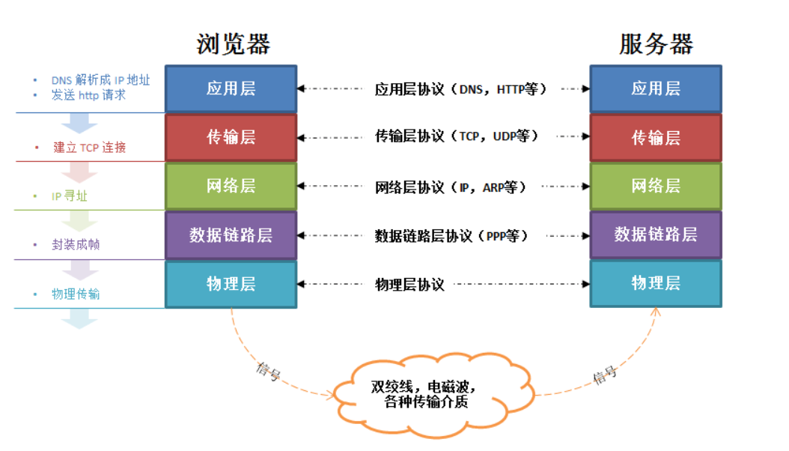

## TCP滑动窗口
滑动窗口协议：   
维持发送方/接收方缓冲区，缓冲区是用来解决网络之间数据不可靠的问题，例如丢包，重复包，出错，乱序   
<https://juejin.im/post/5c9f1dd651882567b4339bce>

## 请求幂等性
一个HTTP方法是幂等的，指的是同样的请求被执行一次与连续执行多次的效果是一样的，服务器的状态也是一样的   
GET，HEAD，PUT和DELETE 等方法都是幂等的，而 POST 方法不是

## HTTP2.0和HTTP1.0有哪些区别？
影响http网络请求的因素主要有2个：  
带宽：网络基础建设已经使得带宽得到极大的提升   
延迟：浏览器阻塞（浏览器最大连接限制）、DNS查询、建立连接   

HTTP1.0和HTTP1.1区别
- 缓存处理
- 带宽优化及网络连接使用
- 错误通知的管理
- Host头处理
- 长连接

HTTP1.1和HTTP2.0区别
- 新的二进制格式
- 多路复用
- header压缩
- 服务端推送

<https://www.cnblogs.com/heluan/p/8620312.html>

## TCP与UDP的区别、场景
TCP和UDP都是传输层协议   
TCP: TCP是面向连接的，并且是一种可靠的协议，再基于TCP进行通信时通信双方要建立TCP连接，建立连接需要经过三次握手，握手成功才可以通信   
优点：可靠，稳定，并且在数据传递时，有确认，窗口，重传，拥塞控制机制   
缺点：慢，效率比较低，占用系统资源，容易被攻击   
TCP应用场景：当对网络通信质量有要求时，文件传输、邮件传输

UDP: UDP是一种面向无连接，在通信过程中，只要目的地址，端口号，源地址，端口号确定了，就可以直接发送信息报文，并且不需要一定能收到或者完整的数据。它仅仅提供了校验和机制来保障报文是否完整，若校验失败，则直接将报文丢弃，不做任何处理   
优点：快，比TCP安全   
缺点：不可靠，不稳定，在网络质量不好的时候容易发生丢包   
应用场景：QQ语音、视频

## TCP三次握手
- 客户机触发服务器，向服务器发出(client->SYN_SEND): SYN=1,seq=x
- 服务器向客户机发送(server->SYN_RCVD): ACK=1,ack=x+1,SYN=1,seq=y
- 客户机回应服务器回应(client->ESTABLISHED, server->ESTABLISHED): ACK=1,ack=y+1

## TCP如何保证可靠
- 校验和：发送方在发送数据之前计算检验和，并进行校验和的填充；接收方收到数据后，对数据以同样的方式进行计算，求出校验和，与发送方的进行比对
- 确认应答与序列号：TCP传输时将每个字节的数据都进行了编号，TCP传输的过程中，每次接收方收到数据后，都会对传输方进行确认应答，ACK报文当中带有对应的确认序列号，告诉发送方，接收到了哪些数据，下一次的数据从哪里发（序列号的作用不仅仅是应答的作用，有了序列号能够将接收到的数据根据序列号排序，并且去掉重复序列号的数据）
- 超时重传：  
  发送方没有接收到响应的ACK报文原因可能有两点： 
      a、数据在传输过程中由于网络原因等直接全体丢包，接收方没有接收到。  
      b、接收方接收到了响应的数据，但是发送的ACK报文响应却由于网络原因丢包了   
  引入超时重传机制：发送方在发送完数据后等待一个时间，时间到达没有接收到ACK报文，那么对刚才发送的数据进行重新发送
- 流量控制：TCP根据接收端对数据的处理能力，决定发送端的发送速度  
在TCP协议的报头信息当中，有一个16位字段的窗口大小，接收端会在确认应答发送ACK报文时，将自己的即时窗口大小填入，并跟随ACK报文一起发送过去。而发送方根据ACK报文里的窗口大小的值的改变进而改变自己的发送速度，如果接收到窗口大小的值为0，那么发送方将停止发送数据。并定期的向接收端发送窗口探测数据段，让接收端把窗口大小告诉发送端   
-  拥塞控制：传输时尽可能快的将数据传输，并且避免拥塞造成的一系列问题。是可靠性的保证，同时也是维护了传输的高效性（1、慢启动，2、拥塞避免，3、拥塞发生，4、快速恢复）

<https://blog.csdn.net/cbjcry/article/details/84925028>

## TCP为什么引入接受缓存这个数据结构
如果没有接受缓存的话，或者说只有一个缓存的话，为了保证接受的数据是按顺序传输的，所以如果位于x序号之后的序号分组先到达目的主机的运输层的话必然丢弃，这样的话将在重传上花费很大的开销，所以一般如果有过大的序号达到接收端，那么会按照序号缓存起来等待之前的序号分许到达，然后一并交付到应用进程

## 大量SYN_RECV什么情况 如何处理
SYN flood

## TCP的断开过程
- 客户机触发服务器，向服务器发出(client->FIN_WAIT-1): FIN=1,seq=u
- 服务器向客户机发送(server->CLOSE_WAIT client->FIN-WAIT-2 ): ACK=1,ack=u+1,seq=v
- 服务器向客户机发送(server->LAST_ACK, client->TIME_WAIT): ACK=1,ack=u+1,FIN=1,seq=w
- 客户机回应服务器回应(client->TIME_WAIT, server->CLOSE): ACK=1,ack=w+1,seq=u+1   

## close_wait、time_wait、为什么2MSL
close_wait: 在Sever端收到Client的FIN消息之后，Server端向Client发送FIN消息之前, Sever端被动关闭等待的时间

time_wait（2MSL）: 
- 可靠的终止TCP连接，若处于time_wait的client发送给server确认报文段丢失的话，server将在此又一次发送FIN报文段，那么client必须处于一个可接收的状态就是time_wait而不是close状态
- 保证迟来的TCP报文段有足够的时间被识别并丢弃，linux 中一个TCPport不能打开两次或两次以上。当client处于time_wait状态时我们将无法使用此port建立新连接，假设不存在time_wait状态，新连接可能会收到旧连接的数据

<https://blog.csdn.net/qzcsu/article/details/72861891>

## 输入url全过程
输入网址 -> DNS解析(本地host文件，本地DNS服务器，DNS根服务器) -> 建立tcp连接 -> 客户端发送HTPP请求 -> 服务器处理请求 -> 服务器响应请求 -> 浏览器展示HTML -> 浏览器发送请求获取其他在HTML中的资源

网络层使用IP协议来选择路线.称为路由功能
ARP : 通过IP地址得知其物理地址
ARP 每一个主机都设有一个ARP高速缓存(ARP cache),里面有所在的局域网上的各主机和路由器的IP地址到硬件地址的映射表

<https://www.cnblogs.com/xiaohuochai/p/9193083.html>

## https加密过程
https  底层SSL/TLS实现  （非对称加密安全但是很浪费资源，一般是第一次用非对称加密后面都用对称加密）  
如：SerA 和 SerB通信   
SerA先用公钥对一串密钥进行加密，SerB用私钥进行解密得到密文   
之后双方都用这串密文进行对称加密通信  

此时还会有一个问题： 
但是在一开始进行非对称加密时，SerB往SerA发送公钥时被黑客拦截并发送自己的生成的公钥给SerA，SerA拿到公钥去加密自己的密文发送给SerB时，中间又被黑客拦截，黑客可以拿自己的私钥对SerA发的密文解密，从而拿到密钥，此时数据就不安全   
解决方法：CA（证书认证机构），当SerA拿到公钥的时候会去CA查一下这个公钥是不是合法可信任的

## Tcp: 拔网线之后连接是否存在为什么
sk->keepalive_probes = 3: 探测次数   
sk->keepalive_time = 30:  探测的超时   
sk->keepalive_intvl = 1: 探测间隔   

对于tcp连接，如果一直在socket上有数据来往就不会触发keepalive，但是如果30秒一直没有数据往来，则keep alive开始工作：发送探测包，受到响应则认为网络，是好的，结束探测，TCP连接可以自动恢复；如果没有相应就每隔1秒发探测包，一共发送3次，3次后仍没有相应，就关闭连接，必须重新建立一个新的长连接进行网络操作

## cookie和session的区别
在网站中，http请求是无状态的。也就是说即使第一次和服务器连接后并且登录成功后，第二次请求服务器依然不能知道当前请求是哪个用户   
- cookie: 第一次登录后服务器返回一些数据（cookie）给浏览器，然后浏览器保存在本地，当该用户发送第二次请求的时候，就会自动的把上次请求存储的cookie数据自动的携带给服务器，服务器通过浏览器携带的数据就能判断当前用户是哪个了    
cookie存储的数据量有限，不同的浏览器有不同的存储大小，但一般不超过4KB。因此使用cookie只能存储一些小量的数据

- session:客户端每次请求服务器的时候会发送当前会话sessionid，服务器根据当前sessionid判断相应的用户数据标志，以确定用户是否登陆或具有某种权限。  
存储在服务器的数据会更加的安全，不容易被窃取。但存储在服务器也有一定的弊端，就是会占用服务器的资源

<https://www.cnblogs.com/pythonbao/p/9053906.html>

## rpc、socket
- socket：TCP协议的接口实现，面向传输层进行网络编程, socket并不是一种协议，是在程序员层面上对TCP/IP协议的封装和应用。其实是一个调用接口，方便程序员使用TCP/IP协议栈而已。程序员通过socket来使用tcp/ip协议。但是socket并不是一定要使用tcp/ip协议，Socket编程接口在设计的时候，就希望也能适应其他的网络协议

- RPC（Remote Procedure call）：远程过程调用，比如说现在有两台服务器A, B，一个在A服务器上的应用想要调用B服务器上的应用提供的某个，由于不在两个方法不在一个内存空间，不能直接调用，需要通过网络表达调用的语义和传达调用的数据。常存在于分布式系统中。