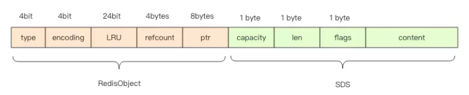
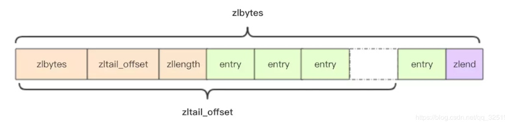
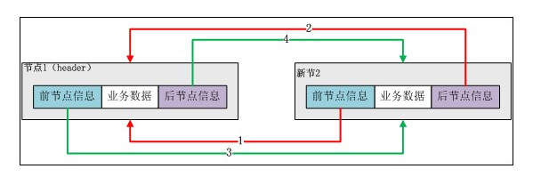
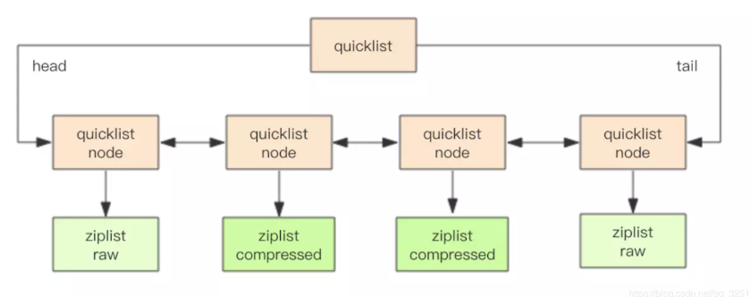
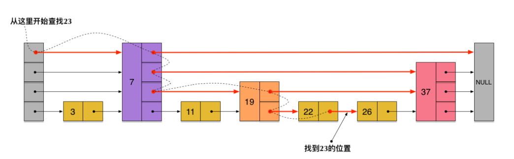
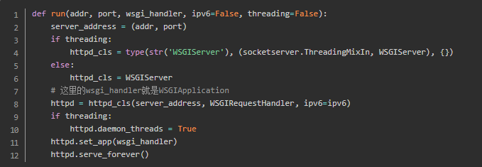
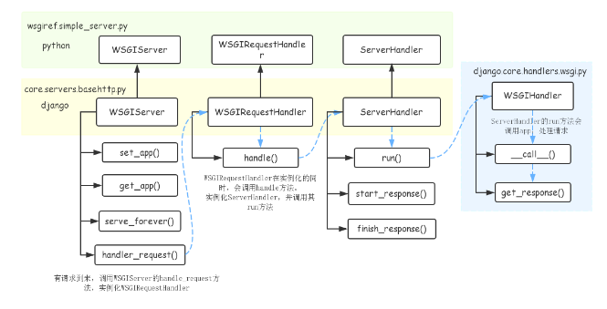
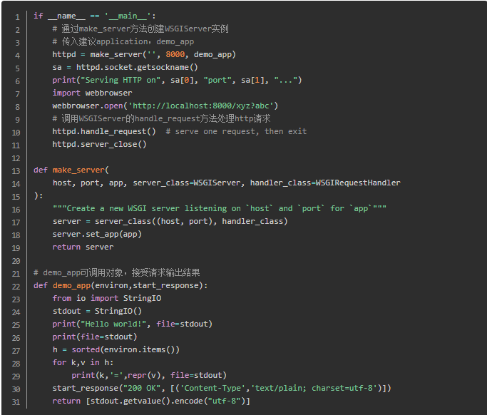
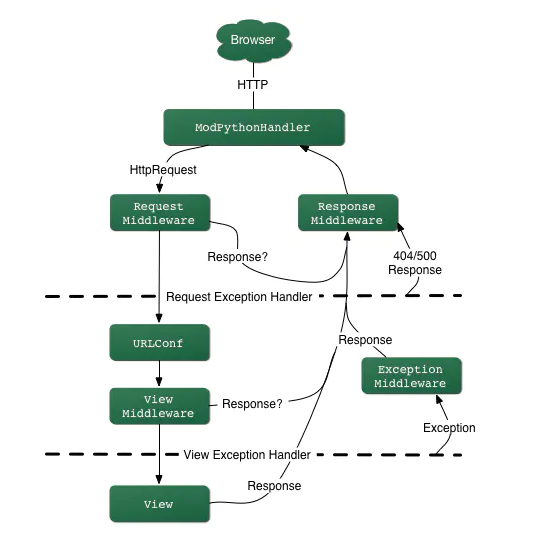

## python中的垃圾回收机制
python语言默认采用的垃圾收集机制是【引用计数法】 

原理：每个对象维护一个ob_ref字段，用来记录该对象当前被引用的次数，每当新的引用指向该对象时，它的引用计数ob_ref加1，每当该对象的引用失效时计数ob_ref减1，一旦对象的引用计数为0，该对象立即被回收，对象占用的内存空间将被释放 

缺点：它不能解决对象的“循环引用”（内存空间在使用完毕后未释放，造成内存泄漏） 
      需要额外的空间维护引用计数   

为了解决对象循环引用问题，python引入标记清除、分代回收两种GC机制   
1、标记清除：  
引用计数的变量ref_count、gc_ref   
它分为两个阶段：第一阶段是标记阶段，GC会把所有的『活动对象』打上标记，第二阶段是把那些没有标记的对象『非活动对象』进行回收   

2、分代回收：是一种以空间换时间的操作方式，Python将内存根据对象的存活时间划分为不同的集合，每个集合称为一个代，Python将内存分为了3“代”，分别为年轻代（第0代）、中年代（第1代）、老年代（第2代），他们对应的是3个链表，它们的垃圾收集频率与对象的存活时间的增大而减小
 
 <https://jin-yang.github.io/post/python-garbage-collection.html>
 
 ## python内存泄露
 1、对象被另一个生命周期特别长的对象所引用   
 比如网络服务器，可能存在一个全局的单例ConnectionManager，管理所有的连接Connection，如果当Connection理论上不再被使用的时候，没有从ConnectionManager中删除，那么就造成了内存泄露   
 2、循环引用中的对象定义了__del__函数   
 如果定义了__del__函数，那么在循环引用中Python解释器无法判断析构对象的顺序，因此就不错处理
 
 <https://www.cnblogs.com/xybaby/p/7491656.html>
 
 ## python装饰器
 装饰器的作用就是为已经存在的对象添加额外的功能
 简单装饰器
  
    def use_logging(func):
        def wrapper(*args, **kwargs):
            logging.warn("%s is running" % func.__name__)
            return func(*args, **kwargs)
        return wrapper
        
    @use_logging #@符号是装饰器的语法糖，在定义函数的时候使用，避免再一次赋值操作
    def bar():
        print("i am bar")
    
    bar()
  
 带参数装饰器：实际上是对原有装饰器的一个函数封装，并返回一个装饰器。我们可以将它理解为一个含有参数的闭包
 
 类装饰器：类装饰器，相比函数装饰器，类装饰器具有灵活度大、高内聚、封装性等优点，使用类装饰器还可以依靠类内部的__call__方法
    
    class Foo(object):
        def __init__(self, func):
            self._func = func
        def __call__(self):
            print ('class decorator runing')
            self._func()
            print ('class decorator ending')
        
    @Foo
    def bar():
        print ('bar')
    
    bar()
    
 functools.wraps:使用装饰器极大地复用了代码，它能把原函数的元信息拷贝到装饰器函数中，这使得装饰器函数也有和原函数一样的元信息了
 
    from functools import wraps
    def logged(func):
        @wraps(func)
        def with_logging(*args, **kwargs):
            print (func.__name__ + " was called")
            return func(*args, **kwargs)
        return with_logging
    
    @logged
    def f(x):
       """does some math"""
       return x + x * x
    
    print (f.__name__)  # prints 'f'
    print (f.__doc__)   # prints 'does some math'
  
## 深拷贝浅拷贝
赋值引用(b=a): a 和 b 都指向同一个对象  
浅拷贝(a.copy()): a 和 b 是一个独立的对象，但他们的子对象还是指向统一对象（是引用）   
深度拷贝(copy.deepcopy(a)): a 和 b 完全拷贝了父对象及其子对象，两者是完全独立的   
<https://www.runoob.com/w3cnote/python-understanding-dict-copy-shallow-or-deep.html>
  
  
 ## select、poll、epoll(io多路复用)
 <https://www.jianshu.com/p/dfd940e7fca2>
 
 ##协程
 协程是一种用户态的轻量级线程，协程的调度完全由用户控制。协程拥有自己的寄存器上下文和栈。协程调度切换时，将寄存器上下文和栈保存到其他地方，在切回来的时候，恢复先前保存的寄存器上下文和栈，直接操作栈则基本没有内核切换的开销，可以不加锁的访问全局变量，所以上下文的切换非常快。   
 
 与线程相比，协程更轻量。一个Python线程大概占用8M内存，而一个协程只占用1KB不到内存。协程更适用于IO密集型的应用。
 
 send
 
    def func():
        while True:
            print("before yield")
            x = yield
            print("after yield:",x)

    g = func()
    next(g) # 程序运行到yield并停在该处,等待下一个next
    g.send(1) # 给yield发送值1,这个值被赋值给了x，并且打印出来,然后继续下一次循环停在yield处
    g.send(2) # 给yield发送值2,这个值被赋值给了x，并且打印出来,然后继续下一次循环停在yield处
    next(g) # 没有给x赋值，执行print语句，打印出None,继续循环停在yield处
    
    # 输出
    before yield
    after yield: 1
    before yield
    after yield: 2
    before yield
    after yield: None
    before yield

<https://www.cnblogs.com/zingp/p/8678109.html> 
<https://www.cnblogs.com/fengf233/p/11548769.html>
<https://www.pythonf.cn/read/99110>

## linux系统打开的文件文件可以被另一个进程删除吗 
linux访问一个文件：  
从根目录/的inode不断做3个操作 ==》1、读取目录文件 2、找到对应的inode 3、从对应块读取内容   
如果3读取到的是一个目录文件，继续递归下去，知道读取到目标文件为止   

每个文件都会有2个link计数器-- i_count 和 i_nlink  
i_count的意义是当前使用者的数量，也就是打开文件进程的个数；i_nlink的意义是介质连接的数量  
可以理解为 i_count是内存引用计数器，i_nlink是硬盘引用计数器,当文件被某个进程引用时，i_count 就会增加；当创建文件的硬连接的时候，i_nlink  就会增加  
i_nlink 是文件删除的充分条件，而 i_count 才是文件删除的必要条件  

rm 操作只是将 i_nlink 置为 0 了  

<https://www.jianshu.com/p/dde6a01c4094>
<https://www.jianshu.com/p/fda6526aad1b>
<https://jaycechant.info/2020/correct-way-to-delete-an-opened-file/>

## redis主从同步过程
SYNC   
1、全量同步   
    1）从服务器连接主服务器，发送SYNC命令；   
　　2）主服务器接收到SYNC命名后，开始执行BGSAVE命令生成RDB文件并使用缓冲区记录此后执行的所有写命令；  
　　3）主服务器BGSAVE执行完后，向所有从服务器发送快照文件，并在发送期间继续记录被执行的写命令；  
　　4）从服务器收到快照文件后丢弃所有旧数据，载入收到的快照；  
　　5）主服务器快照发送完毕后开始向从服务器发送缓冲区中的写命令；  
　　6）从服务器完成对快照的载入，开始接收命令请求，并执行来自主服务器缓冲区的写命令；  

2、增量同步  
    Redis增量复制是指Slave初始化后开始正常工作时主服务器发生的写操作同步到从服务器的过程  

PSYNC   
Redis 2.8以后提供了PSYNC优化了断线重连的效率   
PSYNC执行过程中比较重要的概念有3个：runid、offset（复制偏移量）以及复制积压缓冲区   

<https://blog.csdn.net/sk199048/article/details/50725369>
<https://blog.csdn.net/sk199048/article/details/77922589>
<https://www.cnblogs.com/kevingrace/p/5685332.html>

## TCP滑动窗口
滑动窗口协议：   
维持发送方/接收方缓冲区，缓冲区是用来解决网络之间数据不可靠的问题，例如丢包，重复包，出错，乱序   
<https://juejin.im/post/5c9f1dd651882567b4339bce>

## TCP三次握手

## redis限流
通过限流，在请求数量超出阈值的时候就排队等待甚至拒绝服务   
1、固定窗口法（计数器法）：维护一个单位时间内的计数器 Counter，如判断单位时间已经过去，则将计数器归零   
2、滑动窗口法：时间的推移，时间窗口也会持续移动，有一个计数器不断维护着窗口内的请求数量，这样就可以保证任意时间段内，都不会超过最大允许的请  求数   
3、令牌桶法：固定速率往桶中添加令牌，如果桶中令牌不够，则拒绝新请求   
            限制平均流入速率，允许一定程度的突发请求（支持一次拿多个令牌）   
4、漏桶算法：流入请求速率任意，常量固定速率流出请求。当流入请求数积累到漏桶容量时，则拒绝新请求   
            限制常量流出速率（流出速率是固定值），从而 平滑突发流入速率   

<https://blog.biezhi.me/2018/10/rate-limit-algorithm.html>
<https://juejin.im/post/5e3e75c2e51d4526f3639ae3>

 
## redis数据结构
###LString: SDS(简单动态字符串)

字符串编码类型:  
int编码: 保存的是可以用 long 类型表示的整数值   
raw编码: 保存长度大于44字节的字符串（redis3.2版本之前是39字节，之后是44字节）   
embstr编码: 保存长度小于44字节的字符串（redis3.2版本之前是39字节，之后是44字节）   

embstr和raw都是由redisObject和sds组成的,不同的是：embstr的redisObject和sds是连续的，只需要使用 malloc 分配一次内存；而raw需要为redisObject和sds分别分配内存，即需要分配两次内存   
embstr少分配一次内存，更方便,但embstr也有明显的缺点：如要增加长度，redisObject和sds都需要重新分配内存   

    redisObject  
    struct RedisObject {
        int4 type; // 4bits
        int4 encoding; // 4bits
        int24 lru; // 24bits
        int32 refcount; // 4bytes = 32bits
        void *ptr; // 8bytes，64-bit system
    }
 

    SDS
    struct SDS {
            unsigned int capacity; // 4byte
            unsigned int len; // 4byte
            byte[] content; // 内联数组，长度为 capacity
         }

为什么会选择44作为两种编码的分界点

64byte - 16byte -3byte -1byte = 44byte
 
###List: quicklist(快速列表)-->ziplist压缩列表、linkedlist双端链表

####压缩链表（ziplist）：
当一个列表中只包含少量列表项，且是小整数值或长度比较短的字符串时，redis就使用ziplist（压缩列表）来做列表键的底层实现   
每一个节点之间没有指针的指向，而是多个元素相邻  

压缩列表占用内存少，但是是顺序型的数据结构，插入删除元素的操作比较复杂   
压缩列表适合数据比较小的情况

    struct ziplist<T> {
        int32 zlbytes; // 整个压缩列表占用字节数
        int32 zltail_offset; // 最后一个元素距离压缩列表起始位置的偏移量，用于快速定位到最后一个节点
        int16 zllength; // 元素个数
        T[] entries; // 元素内容列表，挨个挨个紧凑存储
        int8 zlend; // 标志压缩列表的结束，值恒为 0xFF
    }

#####双端列表（linkedlist）
节点带有prev、next指针、head指针和tail指针，获取前置节点、后置节点、表头节点和表尾节点、获取长度的复杂度都是O(1)  
当数据比较多的时候，双端列表的高效插入删除还是更好的选

#####快速列表（quicklist）
redis数据结构的选择，时间上、空间上都要达到极致，所以，他们将压缩列表和双端列表合二为一

    快速列表（quicklist）
    rpush: listAddNodeHead ---O(1)
    lpush: listAddNodeTail ---O(1)
    push:listInsertNode ---O(1)
    index : listIndex ---O(N)
    pop:ListFirst/listLast ---O(1)
    llen:listLength ---O(N)

###Hash: ziplist压缩列表、hashtable哈希表
#####hashtable哈希表
hashmap采用了链地址法的方法解决了哈希冲突的问题   

渐进式rehash  
大字典的扩容是比较耗时的,需要重新申请新的数组，然后将字典所有链表中的元素重新挂载到新的数组下面，这是O(n)级别的操作  
搬迁操作埋伏在当前字典的后续指令中（来自客户端的hset、hdel等指令）  
redis还会在定时任务中对字典进行主动搬迁

扩容条件  
当hash中元素的个数等于第一维数组的长度时，就会开始扩容，扩容的新数组是原数组大小的2倍  

缩容条件  
元素个数低于数组长度的10%

####et: intset整数集合、hashtable哈希表
当数据都是整数并且数量不多时，使用intset作为底层数据结构；当有除整数以外的数据或者数据量增多时，使用hashtable作为底层数据结构  
#####intset整数集合
ntset底层实现为有序、无重复数的数组，intset的整数类型可以是16位的、32位的、64位的

###Zset: ziplist压缩列表、skiplist跳表
#####skiplist跳表
skiplist本质上也是一种查找结构，用于解决算法中的查找问题（Searching），即根据给定的key，快速查到它所在的位置（或者对应的value）

##请求幂等性
一个HTTP方法是幂等的，指的是同样的请求被执行一次与连续执行多次的效果是一样的，服务器的状态也是一样的   
GET，HEAD，PUT和DELETE 等方法都是幂等的，而 POST 方法不是

##django WSGI
WSGI: 描述web server与web application通信的规范   
uwsgi: 是uWSIG服务器的独占协议，用于定义传输信息的类型   
uWSIG: 是一个web服务器，实现了WSGI协议、uwsgi协议、http协议等   

例如：uWSGI和Gunicorn都是实现了WSGI server协议的服务器，Django、Flask是实现了WSGI application协议的web框架  

WSGI协议主要包括server和application两部分:   
WSGI server：负责从客户端接收请求，将request转发给application，将application返回的response返回给客户端   
WSGI application：接收server转发的request，处理请求，并将处理结果返回给server   

#####django WSGI application
WSGI application应该实现为一个可调用对象，需要接收两个参数
- 一个字典，该字典包含了客户端请求的信息以及其它信息，可以认为是请求上下文，一般叫做environment（environ、evn）
- 一个用于发送HTTP响应状态（HTTP status）、响应头（HTTP headers）的回调函数

application流程包括：
- 加载所有中间件，以及执行框架相关的操作，设置当前线程脚本前缀，发送请求开始信号
- 处理请求，调用get_response()方法处理请求，该方法的主要逻辑是通过urlconf找到对应的view和callback，按顺序执行各种middleware和callback
- 调用server传入的start_response()方法响应hander与status返回给server
- 返回响应正文

#####django WSGI Server
负责获取http请求，将请求传递给WSGI application，由application处理请求后返回response   
通过runserver运行django项目，在启动时都会调用下面的run方法，创建一个WSGIServer的实例，之后再调用server_forever()方法启动服务

下面表示WSGI server服务器处理流程中关键的类和方法

#####django simple_server
django的simple_server.py模块实现了一个简单的HTTP服务器，整个流程：

<https://www.jianshu.com/p/679dee0a4193>

##django请求响应流程
wsgi.py --> WSGIHandler --> base.BaseHandler(self.load_middleware\(django/core/handlers/base.py)) --> MiddlewareMixin(django/utils/deprecation.py) --> self.get_response(django/core/handlers/base.py)   

- 用户请求会到web服务器
- web服务器会把请求发到django.core.handlers.wsgi的BaseHandler
- 生成request，response，view， exception，template_response中间件链表
- 按中间件配置顺序应用request中间件来处理request，如果这中间生成response，则直接返回
- 通过urlresolvers.resolve匹配请求的url来找到对应的view
- 应用view中间件，如果有response，则直接返回
- 调用对应的view，这个过程和和models进行交互，比如从数据库获取数据等，并渲染模板
- 接着response中间件会被应用来处理repsonse

<https://www.jianshu.com/p/1ff05dfb3d0d>

## 什么是僵尸进程
正常情况下，子进程是通过父进程创建的，子进程在创建新的进程。  
子进程的结束和父进程的运行是一个异步过程,即父进程永远无法预测子进程到底什么时候结束。 当一个 进程完成它的工作终止之后，它的父进程需要调用wait()或者waitpid()系统调用取得子进程的终止状态   

####孤儿进程
一个父进程退出，而它的一个或多个子进程还在运行，那么那些子进程将成为孤儿进程。孤儿进程将被init进程(进程号为1)所收养，并由init进程对它们完成状态收集工作

####僵尸进程
一个进程使用fork创建子进程，如果子进程退出，而父进程并没有调用wait或waitpid获取子进程的状态信息，那么子进程的进程描述符仍然保存在系统中

问题及危害
unix提供了一种机制可以保证只要父进程想知道子进程结束时的状态信息：  
在每个进程退出的时候,内核释放该进程所有的资源,包括打开的文件,占用的内存等。 但是仍然为其保留一定的信息(包括进程号the process ID,退出状态the termination status of the process,运行时间the amount of CPU time taken by the process等)。直到父进程通过wait / waitpid来取时才释放 

如果进程不调用wait / waitpid的话， 那么保留的那段信息就不会释放，其进程号就会一直被占用，但是系统所能使用的进程号是有限的，如果大量的产生僵死进程，将因为没有可用的进程号而导致系统不能产生新的进程. 此即为僵尸进程的危害，应当避免   

<https://www.cnblogs.com/anker/p/3271773.html>

##哈希索引和B树索引的区别
###解决hash冲突的方法
- 开放地址法
- 再哈希法
- 链地址法
- 建立公共溢出区

####树索引
- B+树的非叶子节点只是存储key，占用空间非常小，因此每一层的节点能索引到的数据范围更加的广（每次io操作可以搜索更多的数据）
- 叶子节点两两相连，符合磁盘预读特性，顺序读取，不是磁盘寻道加快速度（局部性原理与磁盘预读）
- 支持范围查询，而且部分范围查询非常高效

- hash索引结构检索效率非常高，索引的检索可以一次定位，不像B-Tree索引需要从根节点到枝节点，最后才能访问到叶节点，需要多次IO访问
- hash索引仅仅能满足 '=', 'in' , '< = >' 查询（因为比较的时hash值），不能使用范围查询
- hash索引不能利用部分索引键查询
- hash索引遇到大量Hash值相等的情况后性能不一定会比B-Tree高

