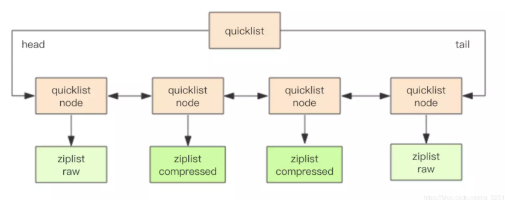
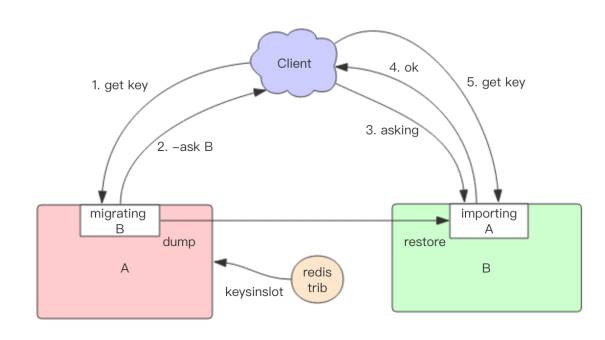

## redis数据结构
### LString: SDS(简单动态字符串)

字符串编码类型:  
int编码: 保存的是可以用 long 类型表示的整数值   
raw编码: 保存长度大于44字节的字符串（redis3.2版本之前是39字节，之后是44字节）   
embstr编码: 保存长度小于44字节的字符串（redis3.2版本之前是39字节，之后是44字节）   

embstr和raw都是由redisObject和sds组成的,不同的是：embstr的redisObject和sds是连续的，只需要使用 malloc 分配一次内存；而raw需要为redisObject和sds分别分配内存，即需要分配两次内存   
embstr少分配一次内存，更方便,但embstr也有明显的缺点：如要增加长度，redisObject和sds都需要重新分配内存   

    redisObject  
    struct RedisObject {
        int4 type; // 4bits 
        int4 encoding; // 4bits
        int24 lru; // 24bits
        int32 refcount; // 4bytes = 32bits
        void *ptr; // 8bytes，64-bit system
    }
 

    SDS
    struct SDS {
            unsigned int capacity; // 4byte
            unsigned int len; // 4byte
            byte[] content; // 内联数组，长度为 capacity
         }

为什么会选择44作为两种编码的分界点

64byte - 16byte -3byte -1byte = 44byte
 
### List: quicklist(快速列表)-->ziplist压缩列表、linkedlist双端链表

#### 压缩链表（ziplist）：
当一个列表中只包含少量列表项，且是小整数值或长度比较短的字符串时，redis就使用ziplist（压缩列表）来做列表键的底层实现   
每一个节点之间没有指针的指向，而是多个元素相邻  

压缩列表占用内存少，但是是顺序型的数据结构，插入删除元素的操作比较复杂   
压缩列表适合数据比较小的情况

    struct ziplist<T> {
        int32 zlbytes; // 整个压缩列表占用字节数
        int32 zltail_offset; // 最后一个元素距离压缩列表起始位置的偏移量，用于快速定位到最后一个节点
        int16 zllength; // 元素个数
        T[] entries; // 元素内容列表，挨个挨个紧凑存储
        int8 zlend; // 标志压缩列表的结束，值恒为 0xFF
    }

#### 双端列表（linkedlist）
节点带有prev、next指针、head指针和tail指针，获取前置节点、后置节点、表头节点和表尾节点、获取长度的复杂度都是O(1)  
当数据比较多的时候，双端列表的高效插入删除还是更好的选

#### 快速列表（quicklist）
redis数据结构的选择，时间上、空间上都要达到极致，所以，他们将压缩列表和双端列表合二为一

    快速列表（quicklist）
    rpush: listAddNodeHead ---O(1)
    lpush: listAddNodeTail ---O(1)
    push:listInsertNode ---O(1)
    index : listIndex ---O(N)
    pop:ListFirst/listLast ---O(1)
    llen:listLength ---O(N)

### Hash: ziplist压缩列表、hashtable哈希表
#### hashtable哈希表
hashmap采用了链地址法的方法解决了哈希冲突的问题   

渐进式rehash  
大字典的扩容是比较耗时的,需要重新申请新的数组，然后将字典所有链表中的元素重新挂载到新的数组下面，这是O(n)级别的操作  
搬迁操作埋伏在当前字典的后续指令中（来自客户端的hset、hdel等指令）  
redis还会在定时任务中对字典进行主动搬迁

扩容条件  
当hash中元素的个数等于第一维数组的长度时，就会开始扩容，扩容的新数组是原数组大小的2倍  

缩容条件  
元素个数低于数组长度的10%

### set: intset整数集合、hashtable哈希表
当数据都是整数并且数量不多时，使用intset作为底层数据结构；当有除整数以外的数据或者数据量增多时，使用hashtable作为底层数据结构  
#### intset整数集合
ntset底层实现为有序、无重复数的数组，intset的整数类型可以是16位的、32位的、64位的

### Zset: ziplist压缩列表、skiplist跳表
#### skiplist跳表
skiplist本质上也是一种查找结构，用于解决算法中的查找问题（Searching），即根据给定的key，快速查到它所在的位置（或者对应的value）

## redis持久化
- 快照：全量备份，是内存数据的二进制序列化形式，在存储上非常紧凑   
- AOF：连续的增量备份，记录的是内存数据修改的指令记录文本   
AOF在长期运行过程中变得无比庞大，重启时需要加载AOF日志进行指令重放这个时间就会变得无比漫长，需要定期进行AOF重写

快照原理： 
问题：  
1、在服务线上请求，redis还要进行内存快照，文件io操作不能使用io多路复用，会严重拖累服务器性能   
2、持久化的同时内存结构还在改变（比如一个大型的hash字典正在持久化，请求把它删除，可是还没有持久化完成）   

redis在持久化时会调用glibc函数fork产生一个子进程，快照持久化完全给子进程处理，父进程接收客户端请求。子进程刚刚产生时和父进程共享内存里面的代码段和数据段，在进程分离的一瞬间内存的增长几乎没有明显变化，子进程做数据持久化，不会修改现有的内存数据结构，只是对数据结构进行遍历读取，然后序列化写到磁盘   

Rdis使用操作系统的多进程COW（copy on write）机制实现快照持久化，COW机制进行数据段页面分离，当父进程对其中一个页面数据进行修改时，会将被共享的页面复制一份分离出来，然后对这个复制的页面进行修改，子进程相对应的页面是没有变化的，还是进程产生时那一瞬间

触发机制：
- save（同步） 阻塞、会替换老的文件、O(n)
- bgsave（异步） fork一个子进程，极少数下很慢也会阻塞掉主进程
- 自动，按照配置通过bgsave自动生成RDB（频繁使用RDB，数据量大的话会对硬盘造成压力）

AOF原理： 
先执行指令才将日志存盘  

AOF重写：Redis 提供bgrewriteof指令对AOF日志进行瘦身，原理就是开辟一个子进程对内存遍历，转换成一系列redis的操作指令，序列化到一个新的AOF日志文件中，序列化完毕后再将操作期间发生的增量AOF日志追加到这个新的AOF日志文件中，追加完毕替代旧的AOF日志文件   

fsync： AOF日志是以文件的形式存在，当程序对AOF日志文件进行写操作时，实际上是将内容写到了内核为文件描述符分配的一个内存缓存中，然后内核会异步将脏数据刷回到磁盘，如果机器宕机，AOF没来的及完全刷到磁盘，这时候会出现日志丢失   
linux提供fsync函数可以将指文件的内容强制从内核缓存刷到磁盘，只要Redis进程实时调用fsync函数就可以保证AOF日志不丢失，fsync是一个磁盘io操作很慢，生产环境通常是每个1s执行一次fsync

3种策略
- always  每条 （IO大）
- everysec  默认配置1秒 （丢失有1s数据）
- no  根据操作系统决定（不可控）

# redis限流
通过限流，在请求数量超出阈值的时候就排队等待甚至拒绝服务   
1、固定窗口法（计数器法）：维护一个单位时间内的计数器 Counter，如判断单位时间已经过去，则将计数器归零   
2、滑动窗口法：时间的推移，时间窗口也会持续移动，有一个计数器不断维护着窗口内的请求数量，这样就可以保证任意时间段内，都不会超过最大允许的请  求数   
3、令牌桶法：固定速率往桶中添加令牌，如果桶中令牌不够，则拒绝新请求   
            限制平均流入速率，允许一定程度的突发请求（支持一次拿多个令牌）   
4、漏桶算法：流入请求速率任意，常量固定速率流出请求。当流入请求数积累到漏桶容量时，则拒绝新请求   
            限制常量流出速率（流出速率是固定值），从而 平滑突发流入速率   

<https://blog.biezhi.me/2018/10/rate-limit-algorithm.html>
<https://juejin.im/post/5e3e75c2e51d4526f3639ae3>

## redis-cell分布式限流

## 怎么保证redis和db数据一致
写流程：  
(1)先淘汰cache   
(2)再写db

读流程：  
(1)先读cache，如果数据命中hit则返回   
(2)如果数据未命中miss则读db   
(3)将db中读取出来的数据入缓存
 
 什么情况下可能出现缓存和数据库中数据不一致呢？
 
 
 
 在分布式环境下，数据的读写都是并发的  
a）发生了写请求A，A的第一步淘汰了cache（如上图中的1）  
b）A的第二步写数据库，发出修改请求（如上图中的2）   
c）发生了读请求B，B的第一步读取cache，发现cache中是空的（如上图中的步骤3）   
d）B的第二步读取数据库，发出读取请求，此时A的第二步写数据还没完成，读出了一个脏数据放入cache（如上图中的步骤4

解决方案：
- 采用延时双删策略   
在写库前后都进行redis.del(key)操作，并且设定合理的超时时间  
1）先删除缓存  
2）再写数据库   
3）休眠500毫秒   
4）再次删除缓存

- 异步更新缓存(基于订阅binlog的同步机制)   
MySQL binlog增量订阅消费+消息队列+增量数据更新到redis   
1）读Redis：热数据基本都在Redis   
2）写MySQL:增删改都是操作MySQL    
3）更新Redis数据：MySQ的数据操作binlog，来更新到Redis  
读取binlog后分析 ，利用消息队列,推送更新各台的redis缓存数据,一旦MySQL中产生了新的写入、更新、删除等操作，就可以把binlog相关的消息推送至Redis，Redis再根据binlog中的记录，对Redis进行更新   
很类似MySQL的主从备份机制，因为MySQL的主备也是通过binlog来实现的数据一致性(chanal -> 阿里的一款开源框架)

- 对队列的方式读写严格按照先后顺序串行化进行  
更新的数据先写数据库，再执行redis的更新操作

<https://www.cnblogs.com/rjzheng/p/9041659.html?spm=a2c6h.12873639.0.0.2020fe8dgYkc7n>
<https://www.cnblogs.com/rjzheng/p/9240611.html?spm=a2c6h.12873639.0.0.2020fe8dgYkc7n>
<https://www.cnblogs.com/rjzheng/p/9302609.html?spm=a2c6h.12873639.0.0.2020fe8dgYkc7n>
<https://cloud.tencent.com/developer/article/1415091>

## 布隆过滤器
算法：
1. 首先需要k个hash函数，每个函数可以把key散列成为1个整数
2. 初始化时，需要一个长度为n比特的数组，每个比特位初始化为0
3. 某个key加入集合时，用k个hash函数计算出k个散列值，并把数组中对应的比特位置为1
4. 判断某个key是否在集合时，用k个hash函数计算出k个散列值，并查询数组中对应的比特位，如果所有的比特位都是1，认为极有可能存在。

需要查询后端时，先判断key在后端是否存在，这样就能避免后端的压力

布隆过滤器计算有一个简单的公式：
输入--> 预计元素的数量n，错误率f
输出--> 位数组的长度l，hash函数的最佳数量k

redis布隆过滤器只是默认参数的过滤器，在add之前可以通过bf.reserve指令显示创建，有3个参数：key、error_rate（越低，需要空间越大）、initial_size(预计放入元素的数量)，如果对应得key存在bf.reserve会报错

## redis分布式锁
实现   
1.高性能(加、解锁时高性能)   
2.可以使用阻塞锁与非阻塞锁   
3.不能出现死锁   
4.可用性(不能出现节点 down    掉后加锁失败)    

利用 Redis set key 时的一个 NX 参数可以保证在这个 key 不存在的情况下写入成功。并且再加上 EX 参数可以让该 key 在超时之后自动删除    

阻塞锁

    //自定义阻塞时间
    public boolean lock(String key, String request,int blockTime) throws InterruptedException {
    while (blockTime >= 0){
        String result = this.jedis.set(LOCK_PREFIX + key, request, SET_IF_NOT_EXIST, SET_WITH_EXPIRE_TIME, 10 * TIME);
        if (LOCK_MSG.equals(result)){
            return true ;
        }
        blockTime -= DEFAULT_SLEEP_TIME ;
        Thread.sleep(DEFAULT_SLEEP_TIME) ;
    }
    return false ;
    }

解锁: del key   

带来问题：
1. SETNX 和 EXPIRE 非原子性  
保证NX和EX的原子性（redis2.8之后setnx和expire指令可以一起执行），分开执行的话在NX之后程序出现问题就有可能产生死锁
2. 解锁误删除
进程A获取锁设置超时时间，但是由于执行周期较长导致到了超时时间之后就自动释放了，这时进程B获取锁执行很快就释放，这样会出现进程B将进程A的锁释放了   
在加锁的时候把当前的线程ID当做value，并在删除之前验证key对应的value是不是自己线程的ID
3. 超时解锁导致并发
如果线程 A 成功获取锁并设置过期时间 30 秒，但线程 A 执行时间超过了 30 秒，锁过期自动释放，此时线程 B 获取到了锁，线程 A 和线程 B 并发执行   
为获取锁的线程增加守护线程，为将要过期但未释放的锁增加有效时间
4. 无法等待锁释放（阻塞锁但当并发量搭是会影响性能）
使用 Redis 的发布订阅功能，当获取锁失败时，订阅锁释放消息，获取锁成功后释放时，发送锁释放消息

<https://xiaomi-info.github.io/2019/12/17/redis-distributed-lock/>

## redis缓存穿透、缓存击穿、缓存雪崩

- 缓存穿透：查询缓存和DB中不存在的数据   
 带来问题： 如果有黑客会对你的系统进行攻击，拿一个不存在的id 去查询数据，会产生大量的请求到数据库去查询。可能会导致你的数据库由于压力过大而宕掉   
解决办法:   
1、 缓存空值：在API层加基本校验，其次将不存在的key对应的值设置为null放到缓存中，并设置一个较短的过期时间   
2、 BloomFilter：在缓存之前在加一层 BloomFilter ，在查询的时候先去 BloomFilter 去查询 key 是否存在，  如果不存在就直接返回，存在再走查缓存查DB

- 缓存击穿（热点key问题）: 大量的请求同时查询一个正好过期失效的key   
带来问题：会造成某一时刻数据库请求量过大   
解决办法：  
1、对热点key加互斥锁（分布式锁）   
2、设置热点数据永不过期（不加expire需要注意redis的删除机制，设置过期时间标签，如果发现要过期了，则通过一个后台的异步线程进行缓存的构建）   
3、资源保护，服务降级 （降级的最终目的是保证核心服务的可用性）   

- 缓存雪崩：缓存中设置了大批量相同过期时间的数据同时过期失效  
带来问题：会造成某一时刻数据库请求量过大   
解决办法：  
1、在原有的失效时间基础上增加一个随机值，比如1-5分钟随机   
2、热点数据永不过期、互斥锁（高并发的场景不适用，只能保证一个线程拿到这个锁，如果1000个请求，999个都在等待）   

## redis过期键的额删除策略
redis会将每个设置了过期时间的key放入一个独立字典中  
键的过期策略有三种：定时删除、定期删除、惰性删除
- 定时删除： 设置过期键同时设置一个定时器可保证过期键尽快删除  

Redis采用了惰性删除和定期删除两种策略配合   
- 定期删除：  
redis默认每秒进行10次过期扫描，不会遍历过期字典所有key，而是采用贪心算法   
(1) 从过期字典中随机选出20个key    
(2) 删除这20个key中已经过期的key    
(3) 如果过期的key的比例超过1/4，重复1步骤    
为了保证过期扫描不会出现循环过度，算法增加了扫描时间上限，默认不会超过25ms   
如果过期的key很多，redis会持续扫描过期字典循环多次，知道过期字典的过期key变得稀疏才会停止，会导致线上请求明显的卡顿现象，另外一种原因内存管理器需要频繁回收内存页，也会产生CPU消耗   
注意： 如果有大批量的key过期，要给过期时间设置一个随机范围

- 惰性删除
客户端访问key时，对key的过期时间进行检查，如果过期了就立即删除

## LRU
LRU算法：key/value字典加链表实现（最近被访问的时间顺序）   
当空间满时，会踢掉链表尾部的元素，当字典的某个元素被访问时，会被移动到表头    

redis采用的时近似LRU算法：
每个key增加了一个额外的小字段，24bit，最后一次被访问的时间
随机采样出5个个key，淘汰掉最旧的key

当redis内存超出物理内存时，内存数据会开始和磁盘产生频繁的交换（swap），此时性能急剧下降   
redis提供配置参数maxmemory，当内存超出maxmemory时，触发数据淘汰   
配置参数maxmemory_policy，触发数据淘汰后的淘汰策略：   
1、noeviction：不会继续写请求（del可以服务），读请求可以继续进行   
2、volatile-lru：淘汰设置了过期时间的key，采取LRU淘汰，最少使用的key优先被淘汰    
3、allkeys-lru：对所有的键都采取LRU淘汰   
4、allkeys-random：随机回收所有的键   
5、volatile-random：随机回收设置过期时间的键   
6、volatile-ttl：仅淘汰设置了过期时间的键---淘汰生存时间TTL(Time To Live)更小的键

## 惰性删除
删除指令del会直接释放对象的内存，大部分非常快没有延迟，如果删除一个非常大的对象，删除操作就会导致单线程卡顿   
在4.0引入unlink指令，可以对删除操作进行懒处理，丢给后台线程来异步回收内存

flush、flushall 清空数据库也很慢   
指令后面加asyn参数flushall asyn也会把它丢给后台线程来异步回收内存

异步队列：redis主线程会把key的回收操作包装成一个任务，塞进异步队列，后台线程会从这个异步队列中取任务，任务队列被主线程和异步线程同时操作，所以必须是线程安全队列

除del指令和flush操作之外，redis在key的过期、LRU淘汰，rename指令、正在进行全量同步从节点，接收完整rdb文件后，也需要将内存一次性清空等操作过程中，也会进行实施内存回收

## redis快速原因
1. redis是基于内存的，内存的读写速度非常快；
2. redis是单线程的，省去了很多上下文切换线程的时间，不用去考虑各种锁的问题，不存在加锁释放锁操作，没有因为可能出现死锁而导致的性能消耗
3. redis使用多路复用技术，可以处理并发的连接。非阻塞IO 内部实现采用epoll，采用了epoll+自己实现的简单的事件框架。epoll中的读、写、关闭、连接都转化成了事件，然后利用epoll的多路复用特性，绝不在io上浪费一点时间。

## sorted set实现原理？跳表是如何实现的？
set：内部的键值对是无序的、唯一的，它内部实现相当于一个特殊的字典，字典中所有的value值都为NULL   
zset：一方面它是一个set保证内部value的唯一性，另一方面它可以给每个value赋予一个score代表这个value的排序权重

定义一个zsl头指针header，kv之间使用指针串起来形成了双向链表结构，它们是有序排列的从小到大，不同kv层高不一样，随机层数，每个元素都是从kv header出发

    struct zslnode {
     string value;
     double score;
     zslnode*[] forwards; // 多层连接指针
     zslnode* backward; // 回溯指针
    }
    
    struct zsl {
     zslnode* header; // 跳跃列表头指针
     int maxLevel; // 跳跃列表当前的最高层
     map<string, zslnode*> ht; // hash 结构的所有键值对
    }
## redis主从同步过程
SYNC   
1、全量同步   
    1）从服务器连接主服务器，发送SYNC命令；   
　　2）主服务器接收到SYNC命名后，开始执行BGSAVE命令生成RDB文件并使用缓冲区记录此后执行的所有写命令；  
　　3）主服务器BGSAVE执行完后，向所有从服务器发送快照文件，并在发送期间继续记录被执行的写命令；  
　　4）从服务器收到快照文件后丢弃所有旧数据，载入收到的快照；  
　　5）主服务器快照发送完毕后开始向从服务器发送缓冲区中的写命令；  
　　6）从服务器完成对快照的载入，开始接收命令请求，并执行来自主服务器缓冲区的写命令；  

2、增量同步  
    Redis增量复制是指Slave初始化后开始正常工作时主服务器发生的写操作同步到从服务器的过程  

PSYNC   
Redis 2.8以后提供了PSYNC优化了断线重连的效率   
PSYNC执行过程中比较重要的概念有3个：  
1、runid：从节点id   
2、offset（复制偏移量）：向主节点反馈自己同步到哪里   
3、buffer（复制积压缓冲区）：主节点的指令记录在buffer中，buffer是有限的定长的环形数组，如果数组满了就会从头开始覆盖前面的内容，如果从节点短时间无法和主节点同步,buffer中有可能已经被后续指令覆盖掉了，这时候需要快照同步,很有可能陷入死循环，所以务必配置一个合适的复制buffer大小参数   

<https://blog.csdn.net/sk199048/article/details/50725369>
<https://blog.csdn.net/sk199048/article/details/77922589>
<https://www.cnblogs.com/kevingrace/p/5685332.html>

## Redis的高可用方案
Sentinel 负责持续监控主从节点的健康，当主节点挂掉时自动选择一个最优的从节点切换成主节点的地址  
客户端连接集群时，会首先连接sentinel，通过sentinel来查询主节点地址，再连接主节点进行数据交互，主节点发生故障时，客户端会重新向sentinel要地址，sentinel会将最新的地址告诉客户端    

三个定时任务： 
1、每10s每个sentinel对master和slave执行info（发现slave节点、确定主从关系）   
2、每2s每个sentinel通过master节点的channel交换信息（pub/sub）（交互对节点的看法和自身信息）   
3、每1s每个sentinel对其它sentinel和redis执行ping （心跳检测）

主观下线和客观下线：   
主观下线：每个sentinel节点对redis节点失败的"偏见"   
客观下线：所有sentinel节点对redis节点失败"达成共识" (超过quorum个统一)  

选择"合适的"slave节点：  
1、选择slave-priority最高的slave节点   
2、选择复制偏移量最大的slave节点   
3、选择runid最小的slave节点

    >>> from redis.sentinel import Sentinel
    >>> sentinel = Sentinel([('localhost', 26379)], socket_timeout=0.1)
    >>> sentinel.discover_master('mymaster')
    ('127.0.0.1', 6379)
    >>> sentinel.discover_slaves('mymaster')
    [('127.0.0.1', 6380)]

## Redis的Cluster，了解原理吗？如果有节点挂了会怎么样？
- 一致性哈希     
顺时针找到最近的node取值、若要增加节点，也会动到相邻的节点
 
客户端分片：  hash+顺时针（优化取余）   
节点伸缩：只影响邻近节点，但是还有数据迁移（如果n2、n3负责数据量较小添加节点，难以做到负载均衡）    
翻倍伸缩：保证最小迁移数据和负载均衡  

- 虚拟槽分区  
每个槽映射一个数据子集

槽定位算法：redis cluster 默认会对key值使用crc16算法进行hash，得到一个整数值，然后整数值对16384进行取模来得到具体的槽位

- redis集群搭建  
7000、7001、7002为master（分布式）  
7003、7004、7005为slave   
1、创建redis-7000.conf文件，并启动（以此类推剩下5个）   
2、meet 操作   
redis-cli -p 7000 cluster meet 127.0.0.1 7001   
redis-cli -p 7000 cluster meet 127.0.0.1 7002  （2-5）  
3、指派槽  

        # add_slot.sh
        for slot in $(seq $1 $2)
        do
                echo "slot:${slot}"
                redis-cli -p $3 cluster addslots ${slot}
        don 
    sh add_slot.sh 0 5461 7000   
    sh add_slot.sh 5462 10922 7001   
    sh add_slot.sh 10923 16383 7002  
4、主从复制  
redis-cli -p 7003 cluster replicate 892a737339541c80ba363bb60d8c050edc7a3778   
以此类推（7004、7005）

- ruby快速搭建redis集群

        apt install ruby-full  
        gem install redis
        find / -name redis-trib.rb
        cp /usr/share/doc/redis-tools/examples/redis-trib.rb /usr/local/bin/redis-trib.rb
        redis-trib.rb
        redis-trib.rb create --replicas 1 127.0.0.1:7000 127.0.0.1:7001 127.0.0.1:7002 127.0.0.1:7003 127.0.0.1:7004 127.0.0.1:7005
        
 - 跳转   
 当客户端向一个错误的节点发出了指令，而key所在的槽位并不归自己管理，这时它会向客户端发送一个特殊的跳转指令携带目标操作的节点地址，告诉客户端去连这个节点去获取数据。
 
        GET x
        -MOVED 3999 127.0.0.1:6381    
        
   MOVED 指令的第一个参数 3999 是 key 对应的槽位编号，后面是目标节点地址。  
MOVED 指令前面有一个减号，表示该指令是一个错误消息。  
客户端收到 MOVED 指令后，要立即纠正本地的槽位映射表。后续所有 key 将使用新
的槽位映射表
 
 - 迁移   
 Redis 迁移的单位是槽，Redis 一个槽一个槽进行迁移，当一个槽正在迁移时，这个槽就处于中间过渡状态。这个槽在原节点的状态为 migrating，在目标节点的状态为 importing，表示数据正在从源流向目标   
    
大致流程：从源节点获取内容 => 存到目标节点 => 从源节点删除内容   
 在迁移过程中客户端访问流程会有很大变化：  
 访问旧节点：1、存在正常处理   2、不存在有两种可能（在新的节点里面或不存在） 
 旧节点不知道是哪种情况，所以它会向客户端返回一个-ASK targetNodeAddr 的重定向指令。客户端收到这个重定向指令后，先去目标节点执行一个不带任何参数的 asking 指令，然后在目标节点再重新执行原先的操作指令
 
 - moved和ask    
  1、两者都是客户端重定向   
  2、moved：槽已经确定迁移   
  3、ask槽还在迁移
  