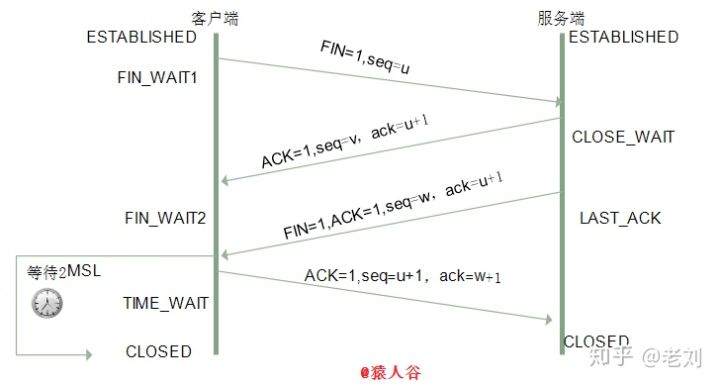

### 一个完整的HTTP请求会涉及到哪些协议

应用层 http 协议  ssl 加密协议

传输层 tcp协议

网络层引入了三个协议，分别是IP协议、ARP协议、路由协议。

ARP协议:IP地址获取MAC地址的一个网络层协议

路由协议:通过ARP协议的工作原理可以发现，ARP的MAC寻址还是局限在同一个子网中，因此网络层引入了路由协议，首先通过IP协议来判断两台主机是否在同一个子网中，如果在同一个子网，就通过ARP协议查询对应的MAC地址，然后以广播的形式向该子网内的主机发送数据包；如果不在同一个子网，以太网会将该数据包转发给本子网的网关进行路由。网关是互联网上子网与子网之间的桥梁，所以网关会进行多次转发，最终将该数据包转发到目标IP所在的子网中，然后再通过ARP获取目标机MAC，最终也是通过广播形式将数据包发送给接收方。

链路层  以太网协议

每层模型的职责：
- 链路层：对0和1进行分组，定义数据帧，确认主机的物理地址，传输数据；
- 网络层：定义IP地址，确认主机所在的网络位置，并通过IP进行MAC寻址，对外网数据包进行路由转发；
- 传输层：定义端口，确认主机上应用程序的身份，并将数据包交给对应的应用程序；
- 应用层：定义数据格式，并按照对应的格式解读数据。

[https://mp.weixin.qq.com/s?__biz=MzUxODAzNDg4NQ==&mid=2247483989&idx=1&sn=7e2ed852770743d3955ef9d5561fcef3&scene=21#wechat_redirect](https://mp.weixin.qq.com/s?__biz=MzUxODAzNDg4NQ==&mid=2247483989&idx=1&sn=7e2ed852770743d3955ef9d5561fcef3&scene=21#wechat_redirect)

[https://www.cnblogs.com/onepixel/p/7092302.html](https://www.cnblogs.com/onepixel/p/7092302.html)

[https://zhuanlan.zhihu.com/p/38240894](https://zhuanlan.zhihu.com/p/38240894)

### 一个10M大小的buffer里存满了数据,现在要把这个buffer里的数据尽量发出去,可以允许部分丢包,问是用TCP好还是UDP好?为什么?

TCP UDP都是传输层协议

TCP:
- TCP 提供一种面向连接的、可靠的字节流服务
- 在一个 TCP 连接中，仅有两方进行彼此通信。广播和多播不能用于 TCP
- TCP 使用校验和，确认和重传机制来保证可靠传输
- TCP 给数据分节进行排序，并使用累积确认保证数据的顺序不变和非重复
- TCP 使用滑动窗口机制来实现流量控制，通过动态改变窗口的大小进行拥塞控制

注意：TCP 并不能保证数据一定会被对方接收到，因为这是不可能的。TCP 能够做到的是，如果有可能，就把数据递送到接收方，否则就（通过放弃重传并且中断连接这一手段）通知用户。因此准确说 TCP 也不是 100% 可靠的协议，它所能提供的是数据的可靠递送或故障的可靠通知。

UDP:
- UDP 缺乏可靠性。UDP 本身不提供确认，序列号，超时重传等机制。UDP 数据报可能在网络中被复制，被重新排序。即 UDP 不保证数据报会到达其最终目的地，也不保证各个数据报的先后顺序，也不保证每个数据报只到达一次
- UDP 数据报是有长度的。每个 UDP 数据报都有长度，如果一个数据报正确地到达目的地，那么该数据报的长度将随数据一起传递给接收方。而 TCP 是一个字节流协议，没有任何（协议上的）记录边界。
- UDP 是无连接的。UDP 客户和服务器之前不必存在长期的关系。UDP 发送数据报之前也不需要经过握手创建连接的过程。
- UDP 支持多播和广播。

[https://blog.fundebug.com/2019/03/22/differences-of-tcp-and-udp/](https://blog.fundebug.com/2019/03/22/differences-of-tcp-and-udp/)

[https://zhuanlan.zhihu.com/p/24860273](https://zhuanlan.zhihu.com/p/24860273)

### Tcp的握手与挥手
三次握手

四次挥手

[https://zhuanlan.zhihu.com/p/86426969](https://zhuanlan.zhihu.com/p/86426969)

[https://hit-alibaba.github.io/interview/basic/network/TCP.html](https://hit-alibaba.github.io/interview/basic/network/TCP.html)

### Http与https的区别加密逻辑

[https://www.cnblogs.com/wqhwe/p/5407468.html](https://www.cnblogs.com/wqhwe/p/5407468.html)
[https://www.jianshu.com/p/6c981b44293d](https://www.jianshu.com/p/6c981b44293d)

### Http各种返回码401和406啥区别

[https://blog.csdn.net/ningxinyu520/article/details/18217077](https://blog.csdn.net/ningxinyu520/article/details/18217077)

### TCP连接中time_wait状态的理解,time_wait在哪一端产生，作用是什么

### OSI，TCP/IP，五层协议的体系结构，以及各层协议

[https://www.nowcoder.com/questionTerminal/6032e54a13b54a81ae2697d2a8477244](https://www.nowcoder.com/questionTerminal/6032e54a13b54a81ae2697d2a8477244)

### TCP/IP Socket http 概念

[https://www.jianshu.com/p/2357fd67e612](https://www.jianshu.com/p/2357fd67e612)\
[https://www.jianshu.com/p/8565912949bb](https://www.jianshu.com/p/8565912949bb)

### 滑动窗口

[https://mp.weixin.qq.com/s/Tc09ovdNacOtnMOMeRc_uA](https://mp.weixin.qq.com/s/Tc09ovdNacOtnMOMeRc_uA)