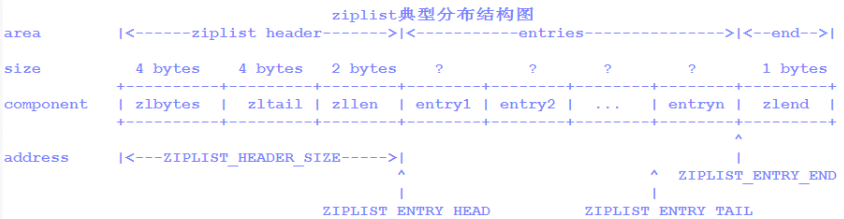

redis知识图谱

### Redis数据结构的底层实现

redis的数据类型 8种

前五种类型:String、list、hash、set、zet

后三种类型分别是:
- bitmap（或简称位图）：使用特殊命令可以处理字符串值，如位数组：您可以设置和清除各个位，将所有位设置为1，查找第一个位或未设置位，等等。
- HyperLogLogs：这是一个概率数据结构，用于估计集合的基数。不要害怕，它比看起来更简单。
- Streams：仅附加的类似于地图的条目集合，提供抽象日志数据类型。

查看key对应value的数据结构  `object encoding key_name`

***String***

string长度不可超过512M

符串是可以修改的，在底层它是以字节数组的形式存在的。Redis中的字符串被称为简单动态字符串「SDS」，这种结构很像Java中的ArrayList，其长度是动态可变的.

redis的数据存储过程中为了提高性能，内部做了很多优化。string 内部还被拆分成三中编码:

int编码: 存储字符串长度小于20且能够转化为整数的字符串

embstr编码: 保存长度小于44字节的字符串(redis3.2版本之前是39字节，之后是44字节)

raw编码: 保存长度大于44字节的字符串(redis3.2版本之前是39字节，之后是44字节)

编码转换

int->raw

条件：数字对象进行append字母，就会发生转换。

embstr->raw

条件：对embstr进行修改，redis会先将其转换成raw，然后才进行修改。所以embstr实际上是只读性质的。

embstr和raw都是由redisObject和sds组成的。不同的是：embstr的redisObject和sds是连续的，只需要使用 malloc 分配一次内存；而raw需要为redisObject和sds分别分配内存，即需要分配两次内存。

所有相比较而言，embstr少分配一次内存，更方便。但embstr也有明显的缺点：如要增加长度，redisObject和sds都需要重新分配内存。

[https://darr-en1.github.io/2020/03/25/1/](https://darr-en1.github.io/2020/03/25/1/)

***List***

Redis中的列表对象在版本3.2之前，列表底层的编码是ziplist和linkedlist实现的，但是在版本3.2之后，重新引入了一个 quicklist 的数据结构，列表的底层都由quicklist实现。

编码转换

ziplist->linkedlist

条件：列表对象的所有字符串元素的长度大于等于64字节 & 列表元素数大于等于512. 反之，小于64和小于512会使用ziplist而不是用linkedlist。

这个阈值是可以修改的，修改选项：list-max-ziplist-value和list-max-ziplist-entriess

ziplist结构：

zlbytes：表示ziplist占用字节数，在执行resize操作时使用

zltail：表示最后节点的偏移量，也是避免了整体遍历list

zllen：表示ziplist节点个数（节点数超过65535,zllen字段值无效,需要遍历才能得到真实数量）

zlend：表示ziplist结束的标识符

ziplist Entry节点数据结构（抽象）：
每个压缩列表节点都由previous_entry_length、encoding、content三个部分组成（不是指实际结构体的字段）

previous_entry_length：前一个节点的长度，用来由后向前遍历，根据前一个节点的长度，可能需要一个或五个字节。

encoding：记录节点保存的数据类型和数据长度。

content：节点保存的数据内容。

这两种存储方式的优缺点

- 双向链表linkedlist便于在表的两端进行push和pop操作，在插入节点上复杂度很低，但是它的内存开销比较大。首先，它在每个节点上除了要保存数据之外，还要额外保存两个指针,单个指针8个字节；其次，双向链表的各个节点是单独的内存块，地址不连续，节点多了容易产生内存碎片。
- ziplist存储在一段连续的内存上，所以存储效率很高。但是，它不利于修改操作，插入和删除操作需要频繁的申请和释放内存。特别是当ziplist长度很长的时候，一次realloc可能会导致大批量的数据拷贝。

`list-max-ziplist-size` 表示按照数据项个数来限定每个quicklist节点上的ziplist长度
 quicklist 默认的压缩深度是 0，也就是不压缩。压缩的实际深度由配置参数`list-compress-depth`决定。为了支持快速的 push/pop 操作，quicklist 的首尾两个 ziplist 不压缩，此时深度就是 1。如果深度为 2，表示 quicklist 的首尾第一个 ziplist 以及首尾第二个 ziplist 都不压缩。

Redis对于quicklist内部节点的压缩算法，采用的LZF——一种无损压缩算法。

[https://juejin.im/post/5df9df506fb9a0160b6380f5](https://juejin.im/post/5df9df506fb9a0160b6380f5)

[https://throwsnew.com/2017/09/12/%E4%B8%BA%E4%BB%80%E4%B9%88Redis%E4%BD%BF%E7%94%A8ziplist%E8%83%BD%E8%8A%82%E7%9C%81%E5%86%85%E5%AD%98/](https://throwsnew.com/2017/09/12/%E4%B8%BA%E4%BB%80%E4%B9%88Redis%E4%BD%BF%E7%94%A8ziplist%E8%83%BD%E8%8A%82%E7%9C%81%E5%86%85%E5%AD%98/)

***Hash***

哈希对象的编码有:ziplist和hashtable

编码转换：ziplist->hashtable

条件：哈希对象所有键和值字符串长度大于等于64字节 & 键值对数量大于等于512

这个阈值也是可以修改的，修改选项：hash-max-ziplist-value和hash-max-ziplist-ent

链地址法解决哈希冲突的问题。

redis中的Hash 结构内部包含两个 hashtable，通常情况下只有一个 hashtable 是有值的。但是在 dict 扩容缩容时，需要分配新的 hashtable，然后进行渐进式搬迁，这时两个 hashtable 存储的分别是旧的 hashtable 和新的 hashtable。待搬迁结束后，旧的 hashtable 被删除，新的 hashtable 取而代之。

渐进式rehash

字典的rehash操作数据量过大时并不是一次完成,而是分批次逐渐进行

rehash过程中新插入字典数据放在[1]哈希表中,并将原[0]中数据重新进行hash计算加入[1]中。读操作将会读取[0]、[1]两个哈希表

rehash过程标志使用dict中属性rehashidx标识

rehash采用cow写时复制技术

***Set***

集合对象的编码有：intset和hashtable

intset:集合对象所有元素都是整数,集合对象元素数不超过512个

编码转换:intset->hashtable

条件：元素不都是整数 & 元素数大于等于512

整数集合特点
- 内容全是数字
- 内存连续
- 元素有序,不可重复

intset底层实现为有序、无重复数的数组。 intset的整数类型可以是16位的、32位的、64位的。如果数组里所有的整数都是16位长度的，新加入一个32位的整数，那么整个16的数组将升级成一个32位的数组。升级可以提升intset的灵活性，又可以节约内存，但不可逆。

***Zset***

它的底层是ziplist（压缩列表）或   skiplist （跳跃表）。

编码转换:ziplist->skiplist

条件：有序集合元素数 >= 128 & 含有元素的长度 >= 64

这个阈值也是可以修改的，修改选项：**zset-max-ziplist-value**和**zset-max-ziplist-entries**

ziplist编码的有序集合使用紧挨在一起的压缩列表节点来保存，第一个节点保存member，第二个保存score。ziplist内的集合元素按score从小到大排序，score较小的排在表头位置。

skiplist不要求上下相邻两层链表之间的节点个数有严格的对应关系，而是为每个节点随机出一个层数(level)

简单分析一下几个查询命令：
- zrevrank由数据查询它对应的排名，这在前面介绍的skiplist中并不支持。
- zscore由数据查询它对应的分数，这也不是skiplist所支持的。
- zrevrange根据一个排名范围，查询排名在这个范围内的数据。这在前面介绍的skiplist中也不支持。
- zrevrangebyscore根据分数区间查询数据集合，是一个skiplist所支持的典型的范围查找（score相当于key，数据相当于value）。

如果只用ziplist来实现，无法做到元素的排序，不支持范围查找，能做到元素的快速查找。

如果只用skiplist来实现，无法做到快速查找，但能做到元素排序、范围操作。

Redis中sorted set的实现是这样的：

当数据较少时，sorted set是由一个ziplist来实现的。

当数据多的时候，sorted set是由一个**dict + 一个skiplist**来实现的。简单来讲，dict用来查询数据到分数的对应关系，而skiplist用来根据分数查询数据（可能是范围查找）。

看一下sorted set与skiplist的关系，：

- zscore的查询，不是由skiplist来提供的，而是由那个dict来提供的。
- 为了支持排名(rank)，Redis里对skiplist做了扩展，使得根据排名能够快速查到数据，或者根据分数查到数据之后，也同时很容易获得排名。而且，根据排名的查找，时间复杂度也为O(log n)。
- zrevrange的查询，是根据排名查数据，由扩展后的skiplist来提供。
- revrank是先在dict中由数据查到分数，再拿分数到skiplist中去查找，查到后也同时获得了排名。

总结起来，Redis中的skiplist跟前面介绍的经典的skiplist相比，有如下不同：

- 分数(score)允许重复，即skiplist的key允许重复。这在最开始介绍的经典skiplist中是不允许的。
- 在比较时，不仅比较分数（相当于skiplist的key），还比较数据本身。在Redis的skiplist实现中，数据本身的内容唯一标识这份数据，而不是由key来唯一标识。另外，当多个元素分数相同的时候，还需要根据数据内容来进字典排序。
- 第1层链表不是一个单向链表，而是一个双向链表。这是为了方便以倒序方式获取一个范围内的元素。
- 在skiplist中可以很方便地计算出每个元素的排名(rank)。

[https://zsr.github.io/2017/07/03/redis-zset%E5%86%85%E9%83%A8%E5%AE%9E%E7%8E%B0/](https://zsr.github.io/2017/07/03/redis-zset%E5%86%85%E9%83%A8%E5%AE%9E%E7%8E%B0/)

***Stream***
[https://erpeng.github.io/2019/04/30/Redis-stream/](https://erpeng.github.io/2019/04/30/Redis-stream/)

[https://juejin.im/post/5ecc8cfa6fb9a047f6103f8f?utm_source=gold_browser_extension#heading-18](https://juejin.im/post/5ecc8cfa6fb9a047f6103f8f?utm_source=gold_browser_extension#heading-18)

###基于REDIS实现延时任务

rabbitmq 可以通过死信队列实现

python 中 celery 可以实现定时任务

前两者不可以修改定时时间

redis可以使用zset实现，可以修改定时时间

[https://juejin.im/post/5caf45b96fb9a0688b573d6c](https://juejin.im/post/5caf45b96fb9a0688b573d6c)

### Redis持久化

[https://juejin.im/post/5b70dfcf518825610f1f5c16](https://juejin.im/post/5b70dfcf518825610f1f5c16)

### Redis的ZSET做排行榜时,如果要实现分数相同时按时间顺序排序怎么实现

[https://blog.csdn.net/zeus_9i/article/details/51025175](https://blog.csdn.net/zeus_9i/article/details/51025175)

### 限流(漏桶算法、令牌桶算法)

[https://www.jianshu.com/p/c02899c30bbd](https://www.jianshu.com/p/c02899c30bbd)

[https://zhuanlan.zhihu.com/p/34762016](https://zhuanlan.zhihu.com/p/34762016)

### Redis主从同步过程

[https://juejin.im/post/5d80ac83e51d45620821cf87](https://juejin.im/post/5d80ac83e51d45620821cf87)

### Redis如何实现高可用

[https://juejin.im/post/5db3f7b5e51d4529ed2918df#heading-18](https://juejin.im/post/5db3f7b5e51d4529ed2918df#heading-18)

### Redis key的过期策略

Redis采用的是 定期删除 和 惰性删除 的内存淘汰机制。

Redis的内存淘汰机制

### Redis6.0

[https://www.cnblogs.com/mr-wuxiansheng/p/12884356.html](https://www.cnblogs.com/mr-wuxiansheng/p/12884356.html)

### Redis Sentinel

添加Sentinel

移除Sentinel

移除一个老的master或不可用的slave

[Redis Sentinel--运维管理](https://blog.51cto.com/darrenmemos/2156538)

#### 从节点优先

Redis实例有个配置参数叫slave-priority。这个信息在Redis从节点实例的INFO输出中展示出来，并且Sentinel使用它来选择一个从节点在一次故障转移中：
- 如果从节点的优先级被设置为0，这个从节点永远不会被提升为主节点。
- Sentinel首选一个由更低（ lower）优先级的从节点。

比如在当前主节点的同一个数据中心有一个从节点S1，并且有另外的从节点S2在另外的数据中心，可以将S1优先级设置为10，S2优先级设置为100，如果主节点挂掉了并且S1和S2都是可用的，S1将是首选的。

#### SDOWN和ODOWN失败状态

主观下线（Subjectively Down ）

客观下线（Objectively Down ）

Redis Sentine有两个不同概念的下线，一个被称为主观下线（Subjectively Down ）条件（SDOWN），是一个本地Sentinel实例下线条件。另一个被称为客观下线（Objectively Down ）条件（ODOWN），是当足够的Sentinels具有SDOWN条件就满足ODOWN，并且从其他的Sentinels使用SENTINEL is-master-down-by-addr命令得到反馈。

从一个Sentinel的角度来看，满足一个SDOWN条件就是在指定的时间内对于PING请求不能收到有效的回复，这个时间在配置文件中是is-master-down-after-milliseconds参数。

一个PING请求可接受的回复是下列之一：

回复+PONG。
回复 -LOADING错误。
回复-MASTERDOWN错误。
其他的回复（或根本没有回复）被认为是无效的。注意一个合理的主节点在INFO输出中通知他自己是一个从节点被认为是下线的。

注意SDOWN需要在配置中整个的时间间隔都没有收到有效的回复，因此对于实例如果时间间隔是30000毫秒，并且我们每隔29秒收到有效的回复，这个实例就被认为在工作。

SDOWN还不够触发故障转移：它仅仅意味着一个单独的Sentinel相信一个Redis实例不可达。要触发故障转移，必须达到ODOWN状态。

从SDOWN转换到ODOWN，没有使用强一致性算法，而仅仅是gossip的形式：如果一个Sentinel在一个给定的时间范围内从足够的Sentinels 得到一个报告说一个主节点没有在工作，SDOWN被提升为ODOWN。如果这个确认稍候消失，这个标识也会清除。

一个更加严格的授权是使用大多数需要为了真正的开始故障转移，但是在达到ODOWN状态之前不会触发故障转移。

ODOWN条件只适用于主节点。对于其他类型的实例，Sentinel不需要采取行动，所以对于从节点和其他的sentinels来说ODOWN状态永远不可能达到，而仅仅只有SDOWN状态。

然而SDOWN也有语义的影响，比如一个从节点在SDOWN状态不会被选举来提升来执行一个故障转移。

#### Sentinels和从节点自动发现

Sentinels和其他的Sentinels保持连接为了互相之间检查是否可达和交换消息。然而你不需要在每个运行的Sentinel 实例中配置其他的Sentinel地址列表，Sentinel使用Redis实例的发布/订阅能力来发现其他的监控相同的主节点和从节点的Sentinels。

通过往名称为__sentinel__:hello的通道发送hello消息（hello messages）来实现这个特性。

同样的，你不需要配置一个主节点关联的从节点的列表，Sentinel也会自动发现这个列表通过问询Redis：

每隔两秒，每个Sentinel向每个监控的主节点和从节点的发布/订阅通道__sentinel__:hello来公布一个消息，宣布它自己的IP，端口，id。
每个Sentinel都订阅每个主节点和从节点的发布/订阅通道__sentinel__:hello，寻找未知的sentinels。当新的sentinels被检测到，他们增加这个主节点的sentinels。
Hello消息也包含主节点的全部配置信息，如果接收的Sentinel有一个更旧的配置，它会立即更新它的配置。
在增加一个主节点的新的sentinel之前，Sentinel总是要检查是否已经有一个有相同的id、地址的sentinel。在这种情况下，所有匹配的sentinels被移除，新的被增加。

#### 脑裂问题

网络不可达导致出现多个master.

redis-py 中 从Sentinel拿到真实的地址，是先连接到Sentinel进程，然后执行sentinel命令获取到master的地址;
每次查询时并不需要执行discover_master和master_for，这些都会在连接的时候自动执行;
发生主从切换时，客户端会通过超时或者ReadOnlyError自动断开连接，然后重新连接的时候会通过再次获取master地址连接到新的master。
[redis-py里的Sentinel到底是如何工作的](https://huangzhw.github.io/2019/03/23/how-redis-py-sentinel-work/)

#### 从节点选举和优先级

当一个Sentinel实例准备执行故障转移，因为主节点在ODOWN状态下并且Sentinel从大多数已知的Sentinel实例中收到了授权开始故障转移，一个合适的从节点要被选举出来。

从节点选举过程评估从节点的下列信息：

与主节点断开的时间
从节点优先级
复制偏移处理
运行ID
一个从节点被发现从主节点断开超过主节点配置超时（down-after-milliseconds 选项）时间十倍以上，加上从正在执行故障转移的Sentinel的角度看主节点不可用的时间，将被认为是不合适的并且会被跳过。

在更严格的条件下，一个从节点的INFO输出建议了从主节点断开超过：

(down-after-milliseconds * 10) + milliseconds_since_master_is_in_SDOWN_state
被认为是不可靠的并且会被无视。

从节点选举只会考虑通过了上述测试的从节点，并根据上面的条件进行排序，以下列顺序：

根据Redis实例中的redis.conf文件中配置的slave-priority进行排序，更低的优先级会被优先。
如果优先级相同，检查复制偏移处理，从主节点收到更加新的数据的从节点会被选择。
如果多个从节点有相同的优先级和数据偏移，执行进一步检查，选择有着更小运行ID的从节点。有一个更小的ID并不是具有正真的优点，但是对于从节点选举来说更确定，而不是随机选择一个从节点。
如果有机器是首选，Redis主节点、从节点必须被配置一个slave-priority。否则，所有的实例都有一个默认的ID。

一个Redis实例可以被配置指定slave-priority为0为了永远不被Sentinels 选择为新的主节点。然而一个这样配置的从节点会被Sentinels重新配置，为了在一次故障转移后复制新的主节点，唯一不同的是，它永远不会成为主节点。

[Redis Sentinel 文档](http://ifeve.com/redis-sentinel/)

#### bloom filter 应用场景

##### 注意
在使用布隆过滤器时，我们一定要有一个清晰的认知:
- 布隆过滤器适用于海量数据级场景;
- 布隆过滤器不会对具体数据进行存储;
- 布隆过滤器判断存在一定误差;

##### 应用

##### 缓存穿透
使用过redis的小伙伴对缓存穿透一定不会陌生，怎么处理恶意的缓存穿透攻击呢,布隆过滤器就是一个很好的解决方案。
在缓存数据预热时,将所有数据的key都放到布隆过滤器中，每次查询的时候都先去布隆过滤器判断，如果没有就直接返回null，
从而避免的对数据库的操作。

##### URL去重
网页爬虫可能需要爬取几十亿、上百亿的网页。
爬虫是通过解析已经爬取页面中的网页链接，然后再爬取这些链接对应的网页。
但同一个网页链接有可能被包含在多个页面中，这就会导致爬虫在爬取的过程中，重复爬取相同的网页。
这个时候布隆过滤器又可以排上用场了。将已经爬取的url写入布隆过滤器，再对新的url进行判断。进而筛选出重复的url。

##### 垃圾短信,垃圾邮件
小伙伴们有没有碰到这种场景，当别人给你发邮件的时候你邮箱并未出现提示，但当你打开垃圾邮件列表的时候，却意外发现它原来在这里。
这是怎么回事呢？其实也很好理解，很有可能是邮件系统的布隆过滤器误判了。
是坏人一定会被抓，这是布隆过滤器可以保证的。但极少数的好人也会被抓，这个可以通过给这些可伶的被误伤的设置个白名单就OK。